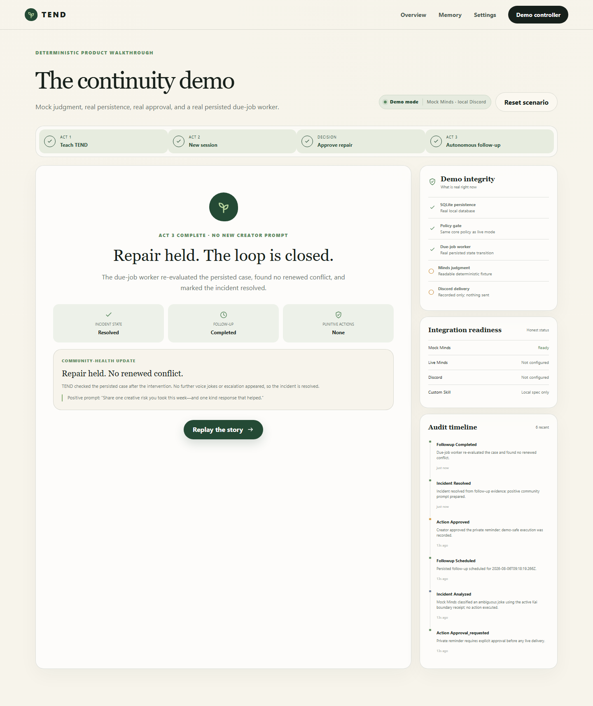

# TEND

> **Moderation shouldn’t reset with every message.**

TEND is a persistent Discord community steward that remembers creator values, member-stated boundaries, and what happened after an incident so creators can make proportionate, restorative decisions.



Live credential-free demo: **https://tend.tangvu.dev**

Judge-readable integration evidence: **https://tend.tangvu.dev/evidence**

Demo film (1:55): **https://youtu.be/seHv0MV4Y0U**

The evidence page includes a source-linked seven-handoff proof spine from
allowlisted intake through persistent memory, schema validation, policy,
human approval, durable follow-up, and grounded outcome.

Continuing development in a new session? Start with [`docs/HANDOFF.md`](docs/HANDOFF.md).

Visual QA captures: [landing desktop](docs/screenshots/landing-desktop.png), [learned receipts desktop](docs/screenshots/demo-learned-desktop.png), [incident desktop](docs/screenshots/demo-incident-desktop.png), [countdown desktop](docs/screenshots/demo-countdown-desktop.png), [resolved desktop](docs/screenshots/demo-resolved-desktop.png), plus matching mobile captures in [`docs/screenshots`](docs/screenshots/).

Tracked judge-ready captures live in `docs/screenshots`. Run `pnpm test:e2e` to generate the latest full-resolution run below `test-results/`.

## Problem

Conventional moderation bots identify isolated rule violations. They do not remember that playful roasting is normal in one server, that a member asked for one topic to stay off-limits, or that a gentle intervention already resolved a conflict. The creator becomes the memory and follow-up layer.

AutoMod keeps a server clean. **TEND helps keep a community healthy.**

## Solution

TEND combines three workflows:

1. **Teach TEND:** creators record values, rules, unwritten norms, tone, boundaries, and autonomy limits. TEND exposes correctable “memory receipts.”
2. **Understand an incident:** a persistent Mind considers the triggering message, nearby conversation, active receipts, tenets, risk, confidence, and uncertainty. TEND proposes the least invasive effective action.
3. **Follow up:** a persisted due-job worker returns later, records whether repair held, closes or escalates the case, and prepares a community-health update.

Consequential actions always wait for a person. Ban and kick are unavailable. Message deletion is not implemented. Timeout requires explicit approval and an allowlisted live worker.

## Why Minds is indispensable

The product thesis is continuity, so Minds is not a chatbot beside TEND. In live mode, one persistent Mind receives creator teaching, structured incident evidence, and later follow-up tasks. Stable conversation aliases, reply fingerprints, validated structured decisions, cognition diagnostics, and a genuine two-session recall proof make that role visible.

SQLite stores the operational state and an auditable mirror of creator-approved facts. TEND does **not** claim that a database row is Mind memory. See [Minds integration](docs/MINDS_INTEGRATION.md).

## Architecture

```text
Discord → allowlisted worker → authenticated intake → TEND policy + Minds adapter
                                                        ↓
Creator dashboard ↔ approval queue ↔ SQLite WAL ↔ persisted due-job worker
                                                        ↑
                               narrow authenticated Custom TEND Skill
```

The pnpm workspace contains:

- `apps/web` — Next.js App Router UI, APIs, Skill tools, and embedded demo scheduler.
- `apps/discord-worker` — Gateway intake, due jobs, and approved action execution.
- `packages/core` — domain schemas, policy, prompt boundaries, and fixtures.
- `packages/minds` — deterministic mock and official live client adapters.
- `packages/db` — migrations, SQLite repositories, seed/reset, and atomic claims.

Read [Architecture](docs/ARCHITECTURE.md) for event sequences, trust boundaries, and the PostgreSQL/queue scale path.

## Demo mode quick start

Requirements: Node 22+ and pnpm. No Minds or Discord credentials are needed.

```text
corepack enable
pnpm install
pnpm demo:reset
pnpm dev
```

Open <http://localhost:3000>, click **Try the three-act demo**, and:

1. teach the seeded creator instruction;
2. start a new session with Jules's ambiguous comment;
3. inspect the Kai boundary receipt that changes the decision;
4. approve the gentle private reminder;
5. wait approximately 12 seconds without another prompt;
6. watch the persisted worker resolve the case.

The web process starts the same due-job service through Next instrumentation. The independently runnable worker is:

```text
pnpm worker:dev
pnpm worker:once
```

Everything simulated is labeled: Mock Minds uses a readable fixture and Discord delivery is a local audit record. SQLite, policy, approval, job scheduling, claim, resolution, and audit state are real.

Every incident exposes a print-friendly **Decision Receipt**. It projects the
decision, cited memory receipts, policy matches, approval state, persisted
follow-up, and audit trail from the same stored snapshot. Creators can download
the strict `tend.decision-receipt.v1` JSON envelope; its SHA-256 digest detects
payload modification but is intentionally not described as proof of signer
identity. Demo disclosures remain attached to the artifact, and live receipt
pages/downloads require the signed creator session.

Deployment health is available at `GET /api/health`. It verifies that persisted community state can be read, returns no incident or member data, and is the Docker image healthcheck target.

For the repository owner's always-on Windows/PM2 deployment profile, see [`ops/windows`](ops/windows/README.md). The profile exposes only the labeled demo through a dedicated Cloudflare tunnel and keeps live Minds credentials out of the hosted process. The public health endpoint and full persisted three-act flow were verified through `https://tend.tangvu.dev` on 2026-08-07.

## Live Minds setup

1. Create/select a Mind and Builder key at the [Minds Builder console](https://build.hellominds.ai/).
2. Copy `.env.example` to an ignored root `.env.local` or `.env`.
3. Set `MINDS_BUILDER_API_KEY`, `MINDS_MIND_ID`, `MINDS_MODE=live`, and `TEND_MODE=live`.
4. Set distinct high-entropy `TEND_CREATOR_ACCESS_KEY` and `TEND_SESSION_SECRET` values of at least 32 characters, plus the exact browser-facing `TEND_PUBLIC_ORIGIN`.
5. Keep every variable server-side; never add `NEXT_PUBLIC_`.
6. Run:

   ```text
   pnpm minds:doctor
   pnpm minds:usage
   pnpm minds:proof
   ```

The diagnostics load ignored `.env.local` and `.env` files from the repository root even though pnpm runs the package command from `packages/minds`.

The proof command teaches one alias and tests recall from a second alias on the same Mind. It exits nonzero if recall is not proven and never hard-codes success.

Live cross-session recall was verified on 2026-08-06; see the [sanitized persistence proof](docs/evidence/minds-persistence-proof.md).

## Discord setup

Use a dedicated test server. Enable Message Content Intent, invite the bot with View Channels, Read Message History, Send Messages, and optionally Moderate Members. Do not grant Administrator, Kick Members, or Ban Members.

Set the Discord variables in ignored secret storage, including `DISCORD_TEST_SERVER_AUTHORIZED=true`, then run web and worker in separate terminals:

```text
pnpm dev
pnpm worker:dev
```

The worker enforces live mode, one guild, channel allowlists, bot/self filtering, authenticated internal intake, idempotent claims, and approval state. Full instructions: [Discord setup](docs/DISCORD_SETUP.md).

## Custom TEND Skill

`docs/tend-skill-openapi.yaml` implements authenticated tools to:

- read active community context;
- list pending incidents;
- propose an action;
- schedule and inspect a follow-up;
- record an incident outcome.

It exposes no Discord enforcement operation. Destructive types are absent from the proposal schema. Deploy TEND behind HTTPS, set a high-entropy `TEND_SKILL_API_KEY`, update the OpenAPI server URL, create the Minds Connection, inspect permissions, then equip and test. The Skill is implemented locally but is **not deployed, equipped, published, or live-verified**. See [Skill setup](docs/MINDS_SKILL_SETUP.md).

## Environment variables

| Variable                         | Required          | Purpose                                                   |
| -------------------------------- | ----------------- | --------------------------------------------------------- |
| `TEND_MODE`                      | No                | `demo` by default; `live` enables external boundaries     |
| `TEND_BASE_URL`                  | Live worker/Skill | Web origin                                                |
| `TEND_PUBLIC_ORIGIN`             | Live dashboard    | Exact trusted browser origin for mutation requests        |
| `TEND_DB_PATH`                   | No                | SQLite path; defaults to `data/tend.db`                   |
| `TEND_CREATOR_ACCESS_KEY`        | Live dashboard    | Single-creator sign-in credential; 32+ characters         |
| `TEND_SESSION_SECRET`            | Live dashboard    | Distinct JWT signing secret; 32+ characters               |
| `DEMO_ACCELERATION_FACTOR`       | No                | Demo-only follow-up acceleration                          |
| `MINDS_MODE`                     | No                | `mock` by default or `live`                               |
| `MINDS_BUILDER_API_KEY`          | Live Minds        | Server-only Builder credential                            |
| `MINDS_MIND_ID`                  | Live Minds        | Selected Mind UUID                                        |
| `MINDS_REPLY_TIMEOUT_MS`         | No                | Live reply timeout; default 180 seconds                   |
| `TEND_SKILL_API_KEY`             | Deployed Skill    | Skill bearer credential                                   |
| `TEND_WORKER_API_KEY`            | Live Discord      | Internal worker/web bearer credential                     |
| `TEND_SKILL_DEPLOYED`            | No                | Honest readiness flag; default `false`                    |
| `TEND_SKILL_EQUIPPED`            | No                | Honest readiness flag; default `false`                    |
| `TEND_SKILL_VERIFIED`            | No                | Honest readiness flag; default `false`                    |
| `DISCORD_BOT_TOKEN`              | Live Discord      | Worker-only bot token                                     |
| `DISCORD_CLIENT_ID`              | Discord setup     | Application ID                                            |
| `DISCORD_GUILD_ID`               | Live Discord      | Only accepted test guild                                  |
| `DISCORD_ALLOWED_CHANNEL_IDS`    | Live Discord      | Comma-separated monitored channels                        |
| `DISCORD_MOD_CHANNEL_ID`         | Moderator notice  | Allowlisted moderator destination                         |
| `DISCORD_TEST_SERVER_AUTHORIZED` | Live Discord      | Must be `true` to confirm explicit test-server permission |

Never paste secret values into chat. `.env`, `.env.local`, databases, and logs are ignored.

## Commands

| Command              | Purpose                                              |
| -------------------- | ---------------------------------------------------- |
| `pnpm dev`           | Start the web dashboard and embedded local scheduler |
| `pnpm worker:dev`    | Start Discord Gateway and independent due worker     |
| `pnpm worker:once`   | Claim at most one due follow-up                      |
| `pnpm demo:reset`    | Restore the deterministic scenario                   |
| `pnpm db:migrate`    | Apply idempotent SQLite migration                    |
| `pnpm minds:doctor`  | Validate key, Mind, status, and cognition            |
| `pnpm minds:usage`   | Print sanitized cognition usage                      |
| `pnpm minds:proof`   | Test genuine cross-session recall                    |
| `pnpm lint`          | ESLint plus package boundary checks                  |
| `pnpm typecheck`     | Strict TypeScript across workspace                   |
| `pnpm test`          | Vitest unit/integration suite                        |
| `pnpm test:e2e`      | Desktop/mobile story plus live-auth boundary         |
| `pnpm build`         | All package and production web builds                |
| `pnpm openapi:lint`  | Validate the Custom TEND Skill OpenAPI document      |
| `pnpm secrets:check` | Reasonable source secret scan                        |
| `pnpm verify`        | Lint, types, tests, build, OpenAPI, and secret scan  |

## Testing

Coverage targets policy authority, active-memory evidence, prompt injection, valid/invalid/timeout Minds results, missing credentials, persisted jobs, bounded retries, dedupe, Discord allowlists, approval-only execution, receipt integrity/data minimization, the complete browser story, every required product screen, responsive overflow, and browser runtime errors.

```text
pnpm verify
pnpm exec playwright install chromium
pnpm test:e2e
docker build -t tend:local .
```

Playwright runs at 1440×900 and 390×844 and asserts no horizontal overflow.
The isolated live-auth server defaults to port `3101`; set
`TEND_LIVE_E2E_PORT` when that port is unavailable.

## Security and privacy

Community messages are explicitly untrusted data and cannot override policy. Live responses are Zod-validated with one repair attempt; failure creates manual review without a hidden LLM. Receipts can be corrected or archived, and only active receipts become evidence. No protected-trait inference or covert profiling is allowed.

See [Security](docs/SECURITY.md) and [Privacy](docs/PRIVACY.md). Live mode fails closed unless the single-creator authentication pair is configured and a signed session is valid. This is an appropriate one-community hackathon boundary, not multi-user identity or per-community authorization. Demo mode remains fully usable without credentials.

## Hackathon judging alignment

- **Minds Integration Depth:** official client, stable aliases, history fingerprinting, reply wait, cognition tools, two-session proof, and narrow Skill API.
- **Creator-Economy Fit:** preserves creator culture while reducing repeated context gathering and follow-up load.
- **Innovation:** combines relationship-aware memory receipts, proportional repair, and autonomous outcome tracking.
- **Execution:** complete no-credential story with real persistence, approvals, worker, responsive UI, portable tamper-evident decision receipts, tests, Docker, and audit.
- **Viability:** clear tenant/storage/queue boundaries plus honest computed metrics.

## Viability

Proposed packaging—billing is not implemented:

- **Free test community:** demo and limited review queue.
- **Creator:** one live community, memory governance, weekly pulse.
- **Growing community:** more channels, moderator seats, faster follow-ups.
- **Agency:** multiple isolated communities, governance export, centralized review.

Estimated moderator minutes saved uses a visible demo assumption: four minutes for a low-risk resolution plus three minutes for a completed follow-up. TEND shows only metrics computed from stored events and labels seeded results as demo data.

## Roadmap

1. Privately equip and verify the Custom TEND Skill.
2. Dedicated Discord test-server verification, including fresh follow-up observation.
3. Multi-user identity, per-community roles, distributed login throttling, and session revocation.
4. PostgreSQL, queue leases, automated retention/deletion, tenant isolation.
5. Moderator collaboration, outcome feedback, and governance exports.
6. Additional connectors only after Discord safety is proven.

## Known limitations

- One community, one shared creator credential, and no billing. Multi-user accounts, role-based community authorization, recovery, MFA, and server-side session revocation are not implemented.
- SQLite and embedded scheduling target one instance.
- Live Minds discovery and cross-session recall are verified. Discord delivery, Discord follow-up observation, and Skill equipment still await dedicated external verification.
- Live follow-up observation is implemented for the independent Discord worker: it reads only the persisted allowlisted source channel, caps fresh non-bot messages at 50, asks the persistent Mind for a validated assessment, and requires grounded evidence plus at least 0.75 confidence to resolve. Missing or uncertain evidence becomes retry/manual review.
- Demo onboarding form is a UX walkthrough; the reset scenario owns durable demo configuration.
- Retention policy is visible but automated purging is not implemented.
- Discord nearby context is capped; attachments are not analyzed.
- Timeout duration is fixed at ten minutes and requires explicit approval.

## License

MIT. See [LICENSE](LICENSE).
