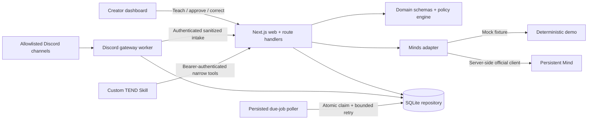

# TEND architecture

## System view

The Mind is the live agent-memory and continuity layer. SQLite is the auditable application mirror and operational store. TEND never calls a matching database row proof of Mind recall.

## Workspace

- `apps/web`: landing, onboarding, creator dashboard, demo controller, APIs, and startup scheduler.
- `apps/discord-worker`: Discord gateway, allowlist filter, authenticated incident intake, approved action executor, and independently runnable scheduler.
- `packages/core`: Zod domain entities, action policy, prompt boundaries, deterministic story constants.
- `packages/minds`: mock/live adapters, stable aliases, one-repair structured output, doctor/usage/proof.
- `packages/db`: migration, SQLite repository, demo seed/reset, atomic job and action claims.

## Main event sequences

### Teach and analyze

1. Creator teaching reaches a `MindsAdapter`.
2. In demo mode, Mock Minds returns a visible fixture reference. In live mode, the official client sends it to a stable per-community conversation.
3. TEND writes creator-approved memory receipts for audit and correction.
4. A later message is wrapped as untrusted data alongside trusted, active tenets and receipts.
5. The adapter returns validated structured data.
6. The policy engine remains authoritative: unavailable actions are removed and consequential actions wait for approval.
7. TEND stores the incident, evidence references, proposal, prompt version, and sanitized audit event.

### Persisted follow-up

1. Approval writes an idempotent action transition and a future follow-up row.
2. A poller selects only due `scheduled`/`retrying` jobs.
3. An atomic update changes one row to `claimed` and increments attempts.
4. A processor returns a typed completion with an explicit evidence kind, incident outcome, and bounded summary. The repository derives the owning community from the follow-up rather than trusting a caller-supplied ID.
5. Resolved outcomes write a community-scoped pulse; manual-review outcomes never fabricate a positive resolution.
6. Transient failure uses bounded backoff; exhausted attempts become `failed` and visible manual review in the incident's owning community.

The embedded web poller starts through Next instrumentation for a one-process demo. `pnpm worker:dev` is the independent worker. Production scale replaces both with queue-backed workers.

The deterministic outcome processor emits `seeded_demo` evidence and is selected only in demo mode. Storage rejects that evidence kind for a live community even if a caller wires the wrong processor. Live completion requires a `live_observation` outcome; until a fresh Discord observation source is connected, the live processor fails closed, retries with bounded backoff, and then becomes visible manual review. It never fabricates “no further conflict.”

## Trust boundaries

| Boundary                 | Control                                                         |
| ------------------------ | --------------------------------------------------------------- |
| Browser → route handlers | Zod validation, bounded strings, no client secrets              |
| Discord → worker         | bot/self filter, guild/channel allowlists, live-mode gate       |
| Worker → web             | dedicated bearer credential and repeated allowlist check        |
| Community content → Mind | explicit untrusted delimiters and anti-instruction prompt       |
| Mind → domain            | JSON parse, Zod schema, one repair, safe manual-review fallback |
| Mind Skill → web         | bearer authentication, no destructive execution tools           |
| Approval → Discord       | persisted `approved` then atomic `executing` claim              |

## Storage and migration path

SQLite runs in WAL mode with foreign keys and a busy timeout. JSON arrays are stored as validated text. Repository interfaces prevent UI, prompt, and Discord code from depending on SQLite types. A fresh demo database receives the fictional Green Room scenario; a fresh live database instead receives a minimal `mode: live` community bound to the configured guild/channel allowlist, with no fictional members, receipts, incidents, or demo metrics.

Scale path:

1. PostgreSQL with tenant-scoped keys and row-level authorization.
2. Queue-backed follow-up and action workers with leased jobs.
3. Per-community Mind aliases or Minds where isolation requirements justify them.
4. Object storage for opt-in evidence attachments.
5. More connectors only after Discord governance is proven.

## Current limits

- One local community and no creator authentication.
- SQLite and the embedded poller assume one web instance.
- Live Minds discovery, cognition health, messaging, and cross-session recall are verified. Skill equipment and Discord delivery still require external setup and have not been verified.
- Live follow-up observation is deliberately fail-closed until fresh Discord context is connected to the processor.
- Nearby Discord context is capped at eight earlier non-bot messages.
- Timeout uses a fixed ten-minute MVP duration after explicit approval.
- No ban, kick, billing, or multi-platform connector.
